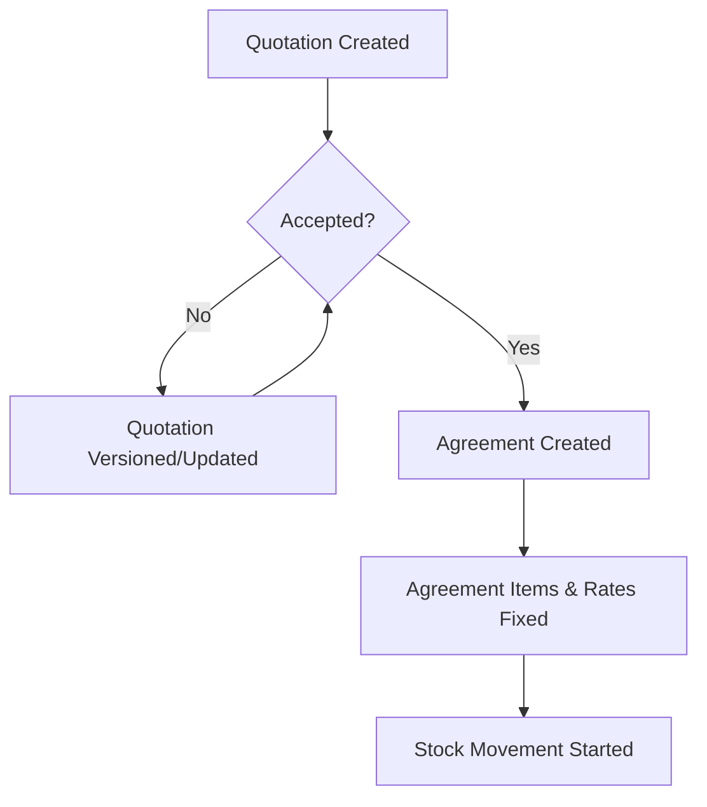
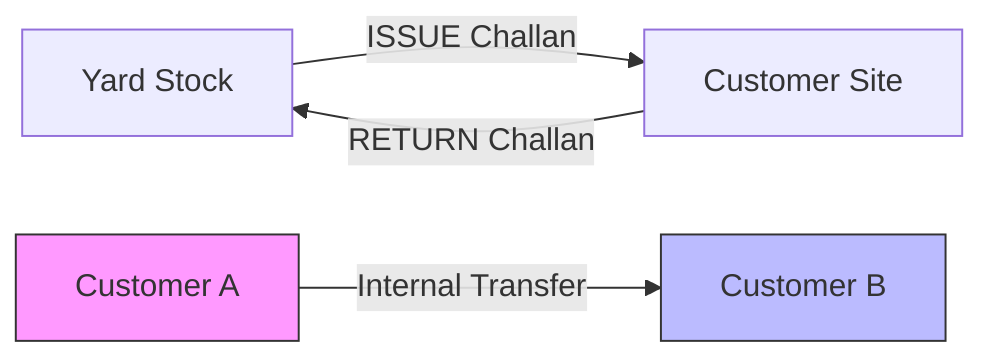

# StockDo: Comprehensive Developer Guide

This document provides a granular, file-level explanation of every module in the StockDo system. It is designed to help developers understand not just *what* the system does, but *how* the code implements it.

---

## 🏗️ Core Architecture & Shared Services

### 1. Database & Persistence
- **File**: `backend/prisma/schema.prisma`
- **Responsibility**: The Single Source of Truth for the entire system's structure.
- **Key Constraints**: 
  - `Challan` and `Bill` use auto-incremented strings (e.g., `BILL00001`) via service-level logic.
  - `ChallanItem` connects `Challan` to `Material`.
  - `QuotationVersion` stores snapshots of quotes as JSON.

### 2. Global Utilities (Frontend)
- **File**: `frontend/src/lib/utils.ts`
  - `formatCurrency`: Uses `en-IN` locale to format numbers in the Indian numbering system (,##,###.##).
  - `cn`: Tailwind merge utility for dynamic styling.
- **File**: `frontend/src/lib/api.ts`
  - Centralized Axios instance with a base URL.
  - Every frontend page uses functions defined here (e.g., `fetchBills`, `createChallan`) to talk to the backend.

---

## 🔐 Auth & Security Module

**Goal**: Secure identity and Role-Based Access Control (RBAC).

### Backend Components
- `auth.service.ts`: 
  - `validateUser()`: Uses `bcrypt.compare` to check password hashes.
  - `login()`: Issues a JWT containing `{ email, sub (userId), role }`.
- `auth/jwt.strategy.ts`: Validates the JWT on every request and attaches the user object to the request.
- `roles.service.ts`: Manages the `permissions` JSON field in the `Role` table. This JSON defines which modules (e.g., "Accounting", "Stock") are accessible.

---

## 📦 Stock & Inventory Module

**Goal**: Track the physical movement of materials.

### 1. Materials Master
- **File**: `materials.service.ts`
- **Critical Logic**: `getInventorySummary()`
  - It fetches all `Material` records.
  - It fetches all `ChallanItem` records.
  - It manually sums up Issued vs. Returned quantities to calculate "Current Stock In Hand".

### 2. Challan (Issue/Return) Vouchers
- **File**: `challans.service.ts`
- **Create Logic**:
  - `create()`: Checks if the material being issued is part of the customer's *Active Agreement*.
  - Assigns a prefix (`CHN-` for Issue, `RTN-` for Return).
- **Deletion Logic**:
  - `remove()`: **CRITICAL**. When a challan is deleted, the system uses a Prisma Transaction to find any finalized `Bill` dated *after* that challan and deletes them. This prevents the billing history from becoming inconsistent if a historical movement is removed.

### 3. Internal Transfers
- **File**: `transfers.service.ts`
- **Logic**: Creating 3-in-1.
  - When user moves stock from Yard A to Site B.
  - The script creates:
    1. A `Transfer` record (for tracking).
    2. A `RETURN` challan for Yard A (automatically).
    3. An `ISSUE` challan for Site B (automatically).

---

## 📜 Quotations & Agreements Module

**Goal**: Sales and Contract management.

### 1. Quotations (Pre-Contract)
- **File**: `quotations.service.ts`
- **Versioning**: When a quote is updated (`update()`), the service:
  1. Saves the *old* data into `QuotationVersion` as a JSON blob.
  2. Increments the `version` number on the main `Quotation` record.
  3. Deletes and recreates the `items` to reflect the new quote.

### 2. Agreements (Active Contract)
- **File**: `agreements.service.ts`
- **Logic**: An Agreement acts as a "Price List" for a specific Customer site.
- **Validation**: Before creating an Issue Challan, the system checks if an `Active` agreement exists for that customer.

---

## 💰 Accounting & Billing Module

**Goal**: Calculate what the customer owes every month.

### 1. The Billing Algorithm (The "Brain")
- **File**: `billing.service.ts`
- **Method**: `calculateHandlingPeriods()`
  - **Replay System**: It starts from the very first challan ever created for that customer (even before the billing month).
  - **Daily Balance**: It steps through time. If 100 items were issued on Jan 5th, the balance becomes 100. If 50 were returned on Jan 10th, the balance becomes 50.
  - **Closing Segments**: It creates a "Bill Item" for every period where the balance was constant.
    - Example: Jan 1 to Jan 5 (Balance: 0), Jan 5 to Jan 10 (Balance: 100).
- **Days Calculation**: `differenceInDays` is used. A special check `isFullMonth` ensures that if a period spans the entire month, the first/last days are counted correctly.

### 2. GST Calculation Engine
- **File**: `billing.service.ts:createBill`
- **Rules**:
  - `isIntraState`: Compares Company State vs. Customer State.
  - **CGST/SGST (9%+9%)**: Applied if states match.
  - **IGST (18%)**: Applied if states differ.
  - **Transportation GST**: Some systems charge GST on the subtotal *only*, while others include transportation. This is controlled by the `company.gstOnTransportation` toggle.

---

## 📊 Dashboard & Revenue
- **File**: `daily-revenue.service.ts`
- **Logic**: Every day at midnight (or via manual trigger), it calculates the sum of all "Finalized Bills" and "Unbilled Estimate Inventory Rent" to show the company's daily earning potential.

---

## 🔄 Data Lifecycle & Flow

To understand how data moves through StockDo, refer to the diagrams below:

### 1. The Sales to Contract Flow

### 2. Stock Movement Flow

---

## 🚛 Detailed Module Guide (Expansion)

### 9. Module: Purchases & Procurement
- **File**: `backend/src/purchases/purchases.service.ts`
- **Logic**: 
  - Records the purchase of new materials from a **Supplier**.
  - **Ledger Impact**: Automatically creates a `Transaction` associated with the Supplier’s ledger account.
  - **Stock Impact**: Currently, purchases do not automatically increment `Material.totalQty`. The administrator updates the master material quantity after receiving physical stock.

### 10. Module: Vehicle & Logistics
- **File**: `backend/src/vehicles/vehicles.service.ts`
- **Logic**: Tracks the fleet (Plates, Driver, Insurance expiry).
- **Frontend Utility**: `frontend/src/lib/utils.ts` uses the `expiryDate` to return CSS classes (`text-red-500` if expired, `text-yellow-500` if expiring within 30 days).

---

## 🛠️ Developer Tips: "How to add a feature"

If you want to add a new module (e.g., "Expenses"):
1. **Database**: Add the model to `prisma/schema.prisma` and run `npx prisma db push`.
2. **Backend**:
   - Create the module folder using `nest g module/service/controller`.
   - Add a `CreateDto` and `UpdateDto`.
   - Implement the service logic ensuring any financial impact hits the `Transactions` table.
3. **Frontend**:
   - Add API functions to `src/lib/api.ts`.
   - Create the folder structure under `src/app/dashboard/`.
   - Use `src/components/ui` for a consistent look.
   - Use `CustomDialog` or `DataTable` components if applicable to maintain UX consistency.

---

## 🚀 Maintenance & Deployment

### Build Commands
- **Backend**:
  - `npm run build`: Compiles NestJS code into `dist/`.
  - `npx prisma generate`: Re-generates the Prisma Client after schema changes.
- **Frontend**:
  - `npm run build`: Generates the optimized Next.js production build.

### Database Management
- **Prisma**: All schema changes must be defined in `backend/prisma/schema.prisma` and pushed via `npx prisma db push` or migrations.
- **Supabase**: The hosted PostgreSQL database and Storage buckets (for logos) are managed via the Supabase Dashboard.

### Coding Conventions
- **Standardized DTOs**: Every backend POST/PATCH request must have a corresponding DTO in the `dto/` folder of the module.
- **Prisma Transactions**: Atomic operations (like Transfers or Bill Finalization) use `this.prisma.$transaction` to prevent data corruption.
- **Tailwind & UI**: Global styles are in `frontend/src/app/globals.css`. New components should use the Shadcn CLI or match the existing primitive patterns.
